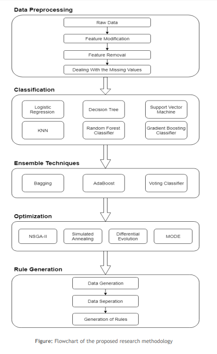

*Code cannot be shared due to privacy reasons*

# Analysis of accidents that take place in industries

 Now-a-days in any industry, occurrence of accidents during the work period are quite often, so they lead to different types of impacts such as equipment property damage, fire, release of toxic gases, injury to workers present at the workplace etc. It has been a challenge to deal with these accidents. In order to overcome these challenges, it is important to find out the reasons behind it and have some early preparation to avoid it. So we analysed the data of accidents of a particular factory, used various machine learning algorithms and optimization techniques, to generate rules for the cause for the accidents. The procedure followed can be seen the image.
 

1. #### Data Cleaning
   Raw data cannot be passed directly into machine learning algorithms. We have to preprocess them, look for missing values, detect outliers due to human error etc. So we use pandas library to manipulate the data and clean it.

2. #### Classification
   After preprocessing step, we pass the data into machine learning models, which were implemented using Scikit-Learn library. The models used can be seen in the flowchart. 
  * [Logistic Regression](https://en.wikipedia.org/wiki/Logistic_regression)
  * [Decision Tree Classifier](https://www.sciencedirect.com/topics/computer-science/decision-tree-classifier)
  * [Support Vector Classifier](https://towardsdatascience.com/support-vector-machine-introduction-to-machine-learning-algorithms-934a444fca47)
  * [K-Nearest Neighbors](https://www.saedsayad.com/k_nearest_neighbors.htm)
  

3. #### Ensembling
   Ensembling is the process of combining multiple classifiers together. This gives us better accuracy. 
* [Random Forest Classifier](https://en.wikipedia.org/wiki/Random_forest)
* [Gradient Boosting Classifier](https://stackabuse.com/gradient-boosting-classifiers-in-python-with-scikit-learn/)
* [AdaBoost](https://en.wikipedia.org/wiki/AdaBoost)
* [Bagging](https://www.geeksforgeeks.org/ml-bagging-classifier/)
* [Simple Voting Classifier](https://medium.com/@sanchitamangale12/voting-classifier-1be10db6d7a5)

4. #### Optimization
   In order to assign importance to the predictions of models used in a voting classifier we use various optimization techniques. 
* [NSGA-II](http://www.cleveralgorithms.com/nature-inspired/evolution/nsga.html)
* [Simulated Annealing](https://www.geeksforgeeks.org/simulated-annealing/)
* [Multi-Objective Differential Evolution](https://dis.ijs.si/tea/Publications/Robic05Demo.pdf)
   

5. #### Rules
   Finally after we have a trained model, we use it to generate rules where accident is more likely to occur.
 

## Results 

         

## Plots

     
